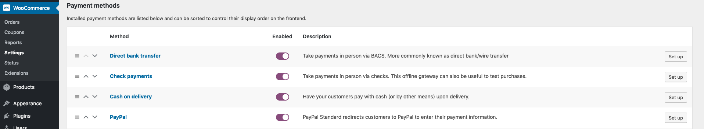

# Cash on Delivery

**Cash on Delivery** is gateway that comes with WooCommerce by default.

## Installation & Setup

**Cash on Delivery** comes with WooCommerce by default. No additional installation is required.

You can enable or disable it in your _wp-admin_ Dashboard.

1.  Visit **WooCommerce** > **Settings**
2.  Click **Payments** tab
3.  **Toggle** the switch in _Enabled_ column
4.  Click **Save Changes**



## Process Payment via REST API

| URL                              | HTTP   | payment_method |
| :------------------------------- | :----- | :------------- |
| `/wp-json/wc/v2/process_payment` | `POST` | `cod`          |

### Request

**POST**: `/wp-json/wc/v2/process_payment`

```json
{
  "order_id": 65,
  "payment_method": "cod"
}
```

| Parameter        | Description                                                                                                                                        |
| :--------------- | :------------------------------------------------------------------------------------------------------------------------------------------------- |
| `order_id`       | `ID` of an existing [_WooCommerce Order Object_](https://woocommerce.github.io/woocommerce-rest-api-docs/?javascript#orders), **without** the `#`. |
| `payment_method` | Each _WooCommerce Payment Gateway_ has a unique `ID`. You can find the corresponding `payment_method` above.                                       |

### Response

#### If the request was successful.

You will receive a response similar to the following.

```json
{
    "code": 200,
    "message": "Payment Successful.",
    "data": {
        "result": "success",
        "redirect": "http://localhost:8888/v/5.1/checkout/order-received/65/?key=wc_order_XXXXXXXXXXXXX"
    }
}
```

The `redirect` contains the url to **order confirmation** page.

#### If the request failed.

You will receive a response similar to the following.

```json
{
    "code": 403,
    "message": "Order status is 'processing', meaning it had already received a successful payment. Duplicate payments to the order is not allowed. The allow status it is either 'pending' or 'failed'. ",
    "data": {
        "status": 400
    }
}
```

The `message` contains the error message and how to fix it.

## Summary

That's it! Easy right? Here's a quick summary.

1.  Send a REST API `POST` Request to `/wp-json/wc/v2/process_payment`
2.  Include a JSON Body with `order_id` and `process_payment` as 'cod'

## Next Step

There're a lot more Gateways that WC REST Payment support!

Check them out at [WC REST Payment Gateways here](../#supported-gateways)!
