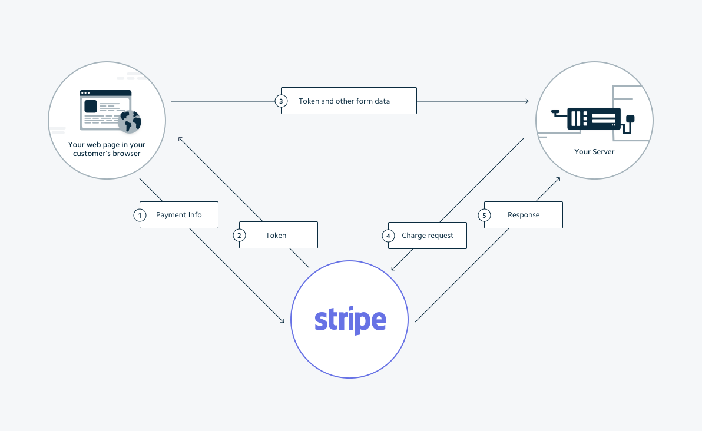

# Stripe Gateway

**WooCommerce Stripe Gateway** is an Addon Gateway Officially Supported by WooCommerce.

Stripe is available in:

-   United States
-   Canada
-   UK
-   Australia
-   Belgium
-   France
-   Germany
-   Ireland
-   The Netherlands
-   [and more](https://support.stripe.com/questions/what-countries-does-stripe-support)

WooCommerce Stripe Gateway supports payments through the classic **Stripe Checkout**.

It also supports payments through Payment Methods including Cards, **Alipay, Bancontact, EPS, GIropay, iDeal, Multibanco, Przelewy24, SEPA Direct Debit and SOFOT**.

This documentation covers how to process payment using REST API via **Stripe Checkout** only. Before getting started, we recommend you to go through [Stripe's Quickstart Guide](https://stripe.com/docs/quickstart).

For other Stripe Payment Methods, you can find them at the bottom.

* * *

## Installation & Setup

For installation, install & activate [**WooCommerce PayPal Checkout Payment Gateway**](https://wordpress.org/plugins/woocommerce-gateway-paypal-express-checkout/) and **WC REST Payment - Stripe Gateway** from you wp-admin Dashboard.

You can enable or disable it in your _wp-admin_ Dashboard.

1.  Visit **WooCommerce** > **Settings**
2.  Click **Payments** tab
3.  **Toggle** the switch in _Enabled_ column
4.  Click **Save Changes**

For help setting up and configuring, please refer to [the user guide](https://docs.woocommerce.com/document/stripe/)


* * *

## Stripe Checkout Workflow

Checkout securely accepts your customer's payment details and directly passes them to Stripe's servers. Stripe returns a token representation of those payment details, which can then be submitted to your server for use.

Here's how Stripe works WooCommerce and WC REST Payment.

.

1.  From your Client (App, Website, etc), the customer’s **payment details are securely sent directly to Stripe’s servers**.
    -   Guide: Website [Installation](https://stripe.com/docs/stripe-js/elements/quickstart#setup) & [Generating Token](https://stripe.com/docs/stripe-js/elements/quickstart#create-token).
    -   Guide: iOS [Installation](https://stripe.com/docs/mobile/ios#getting-started) & [Generating Token](https://stripe.com/docs/mobile/ios/custom).
    -   Guide: Android [Installation](https://stripe.com/docs/mobile/android#installation) & [Generating Token](https://stripe.com/docs/mobile/android#creating-tokens-custom).
2.  Stripe returns a representative **Token** to the Client.
    -   Guide: Website [receiving Token](https://stripe.com/docs/stripe-js/elements/quickstart#create-token).
    -   Guide: iOS [receiving Token](https://stripe.com/docs/mobile/ios/custom#stpapiclient--stpcardparams).
    -   Guide: Android [receiving Token](https://stripe.com/docs/mobile/android#creating-tokens-custom).
3.  Send the Token, along with `order_id`, to your WooCommerce site using REST API.
    -   See below, [Process Payment using REST API](#process-payment-using-rest-api)
4.  The Token, along with WooCommerce Order data, will be sent to Stripe, to create a charge.
    -   This is automatically done by _WC REST Payment_.
5.  Stripe returns a response to your WooCommerce site, and your site returns the resnponse to your Client.

For more detail, you can read the [full description here](https://stripe.com/docs/recipes/switching-to-stripe#how-stripe-works).

A list of test Card numbers and Tokens can be found on [Stripe Testing](https://stripe.com/docs/testing#cards) page.

If you have successfully obtained the Token, please carry on. Otherwise, use one of the test Token above, and carry on.

* * *

## Process Payment using REST API

| URL                              | HTTP   | payment_method |
| :------------------------------- | :----- | :------------- |
| `/wp-json/wc/v2/process_payment` | `POST` | `stripe`       |

### Request

**POST**: `/wp-json/wc/v2/process_payment`

#### Using Stripe Token

If you are using Stripe Token. 

```json
{
	"order_id": 65,
	"payment_method": "stripe",
	"stripe_token":"tok_mastercard",
	"create_account": false,
	"save_source": false
}
```

| Parameter        | Required | Description (External Docs are for references only. No coding  required.)                                                                                                                |
| :--------------- | :------- | :--------------------------------------------------------------------------------------------------------------------------------------------------------------------------------------- |
| `order_id`       | Yes      | `ID` of an existing [_WooCommerce Order Object_](https://woocommerce.github.io/woocommerce-rest-api-docs/?javascript#orders), **without** the `#`.                                       |
| `payment_method` | Yes      | Each _WooCommerce Payment Gateway_ has a unique `ID`. You can find the corresponding `payment_method` above.                                                                             |
| `stripe_token`   | Yes      | Token returned by Stripe in [Step 2 of Workflow^](#stripe-checkout-workflow), or a [test Token](https://stripe.com/docs/testing#cards).                                                  |
| `create_account` | No       | Set to `true` if you wish to [Create a Stripe Customer](https://stripe.com/docs/sources/customers) ([Authentication](../../authentication) Required.), `false` otherwise. Default is `false`.                                               |
| `save_source`    | No       | Set to `true` if you wish to [Save or Update Card Details](https://stripe.com/docs/saving-cards) ([Authentication](../../authentication) Required.), `false` otherwise. Default is `false`.                                                 |

^ Client / Front-end coding is required to exchange Card details for Token.

#### Using Stripe Source

If you are using Stripe Source.

```json
{
	"order_id": 65,
	"payment_method": "stripe",
	"stripe_source":"src_18eYalAHEMiOXXXXXXXXXXXX",
	"create_account": false,
	"save_source": false
}
```

| Parameter        | Required | Description (External Docs are for references only. No coding  required.)                                                                                                                |
| :--------------- | :------- | :--------------------------------------------------------------------------------------------------------------------------------------------------------------------------------------- |
| `order_id`       | Yes      | `ID` of an existing [_WooCommerce Order Object_](https://woocommerce.github.io/woocommerce-rest-api-docs/?javascript#orders), **without** the `#`.                                       |
| `payment_method` | Yes      | Each _WooCommerce Payment Gateway_ has a unique `ID`. You can find the corresponding `payment_method` above.                                                                             |
| `stripe_source`  | Yes      | Source ID. Check out [iOS Source](https://stripe.com/docs/mobile/ios/sources), [Android Source](https://stripe.com/docs/mobile/android/sources) or [JavaScript Source](https://stripe.com/docs/sources/cards).                                                 |
| `create_account` | No       | Set to `true` if you wish to [Create a Stripe Customer](https://stripe.com/docs/sources/customers) ([Authentication](../../authentication) Required.), `false` otherwise. Default is `false`.                                               |
| `save_source`    | No       | Set to `true` if you wish to [Save or Update Card Details](https://stripe.com/docs/saving-cards) ([Authentication](../../authentication) Required.), `false` otherwise. Default is `false`.                                                 |

^ Client / Front-end coding is required to exchange Card details for Token.


### Response

#### If the request was successful.

You will receive a response similar to the following.

```json
{
    "code": 200,
    "message": "Payment Successful.",
    "data": {
        "result": "success",
        "redirect": "http://localhost:8888/v/5.1/checkout/order-received/65/?key=wc_order_XXXXXXXXXXXXX"
    }
}
```

The `redirect` contains the url to **order confirmation** page.

#### If the request failed.

You will receive a response similar to the following.

```json
{
    "code": 403,
    "message": "Order status is 'processing', meaning it had already received a successful payment. Duplicate payments to the order is not allowed. The allow status it is either 'pending' or 'failed'. ",
    "data": {
        "status": 400
    }
}
```

The `message` contains the error message and how to fix it.

## Summary

That's it! Easy right? Here's a quick summary.

1.  Send a REST API `POST` Request to `/wp-json/wc/v2/process_payment`
2.  Include a JSON Body with `order_id`, `process_payment` as `stripe` and `stripe_token`

## Next Step

There're a lot more Gateways that WC REST Payment support!

Check them out at [WC REST Payment Gateways here](../#supported-gateways)!
