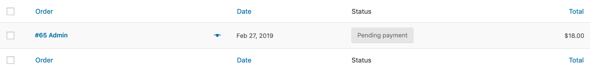
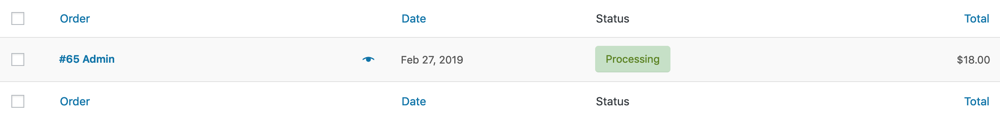

# Getting Started

Hello! Welcome to **WC REST Payment**.

We love WordPress, WooCommerce, and REST API. Wouldn't it be great if we can connect the three?

**WC REST Payment** offers the missing **REST API endpoints to process payment**.

Let's get started!

## Preparation

Firstly, **Setup** _WordPress_ and _WooCommerce_. For more information, please visit [_Prerequisites_](./prerequisites).

Secondly, **Install** _WC REST Payment_. For more information, please visit [_Installation_](./installation).

Lastly, **Secure** your WooCommerce Website and **Authenticate** REST API Request. For more information, please visit [_Security_](./security) and [_Authentication_](./authentication).

## Quick Start

In this guide, we are going to process a payment using REST API, for a WooCommerce Order.



The WooCommerce Order number is **65**. We will be processing the order using **Direct Bank Transfer**.

Here's the REST API request.

* * *

### Request URL

To **process payment** for a WooCommerce Order, send a REST API `POST` request to the following endpoint.

| URL                              | HTTP   | Description                              |
| :------------------------------- | :----- | :--------------------------------------- |
| `/wp-json/wc/v2/process_payment` | `POST` | Process payment for a WooCommerce Order. |

* * *

### Request Body

You will need to send data in a **JSON Body**. A simple example is provided below.

To process payment via **Direct Bank Transfer** for **Order #65**.

```json
{
  "order_id": 65,
  "payment_method": "bacs"
}
```

Here's what they are.

| Parameter       |Required | Description                                                                                                                                        |
| :--------------- | :-| :------------------------------------------------------------------------------------------------------------------------------------------------- |
| `order_id`       |Yes| `ID` of an existing [_WooCommerce Order Object_](https://woocommerce.github.io/woocommerce-rest-api-docs/?javascript#orders), **without** the `#`. [Learn more](./params/order_id). |
| `payment_method` |Yes| Each _WooCommerce Payment Gateway_ has a unique `payment_method`.  [Learn more](./params/payment_method).              |


You can find a list of `payment_method` for more Payement Gateways at the bottom of this guide.

* * *

### Request Response

#### JSON Reponse

If payment is successful, you should receive the following response.

```json
{
    "code": 200,
    "message": "Payment Successful.",
    "data": {
        "result": "success",
        "redirect": "http://localhost:8888/v/5.1/checkout/order-received/65/?key=wc_order_XXXXXXXXXXXXX"
    }
}
```

The `redirect` contains the url to order confirmation page.

#### WooCommerce Orders

You can also see the status changed from `pending` to `processing` for Order 65 at **WooCommerce** > **Orders**, or at `/wp-admin/wp-admin/edit.php?post_type=shop_order`.



* * *

## Summary

That's it! Easy right? Here's a quick summary.

1.  Send a REST API `POST` Request to `/wp-json/wc/v2/process_payment`
2.  Include a JSON Body with `order_id` and `process_payment`

## Next Step

Chances are, you are more interested in more than just 'Direct Bank Transfer'.

There're a lot more Gateways that WC REST Payment support!

Check them out at [WC REST Payment Gateways here](./gateways/#supported-gateways)!
