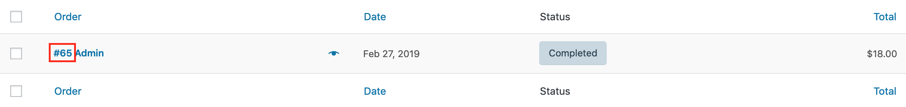
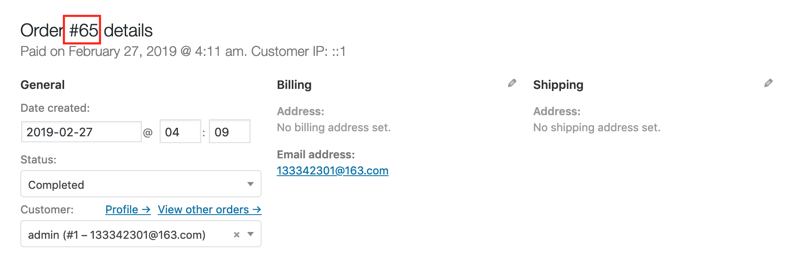

# order_id

`order_id` is **required**. It refers to the `ID` of an existing [_WooCommerce Order Object_](https://woocommerce.github.io/woocommerce-rest-api-docs/?javascript#orders), **without** the `#`. In the example above, `order_id` can be found at **WooCommerce** > **Orders**, or at `/wp-admin/wp-admin/edit.php?post_type=shop_order`.

## Next Step

Continue to [Getting Started](../#request-body).